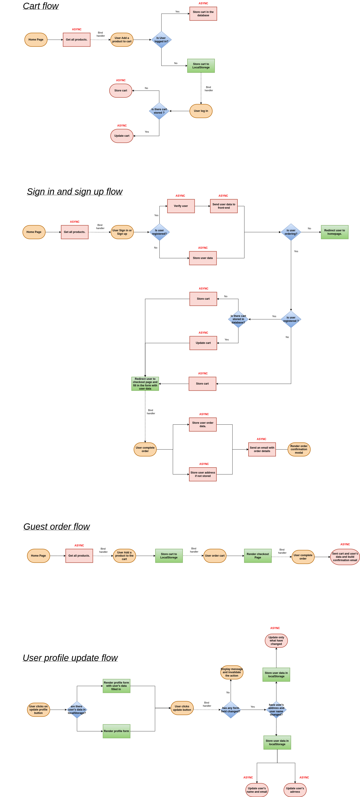
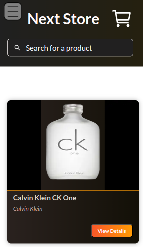
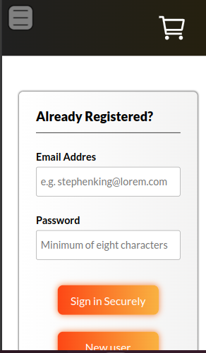
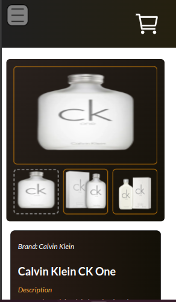
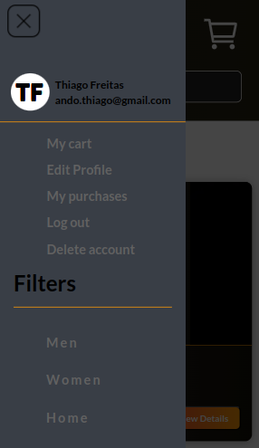

<center><h1> Next Store</h1> </center> </br><p align="center"> </p>
  
<div style="text-align: justify">
The Next Store Online Shopping is a modern, full-stack e-commerce web application built to showcase a professional approach to online shopping platforms. I developed it using React JS, Next JS, Node JS, and Express JS, this project highlights a range of skills, from interactive front-end development to efficient back-end  <a href="https://github.com/ThiagoAndo/Next-store-API.git">API</a>. Designed with user experience at its core, the platform is optimized for ease of use, enabling smooth navigation, intuitive product browsing, and streamlined order processing. By leveraging local storage and a robust API (<a href="https://github.com/ThiagoAndo/Next-store-API.git">Next-store-API</a>), this application provides a seamless shopping experience that’s fast, responsive, and capable of scaling with user demand.
</div>

</div>

## Table of contents

- [Overview](#overview)
  - [Key Features](#key-features)
  - [Actions](#actions)
  - [Built using](#built-using)
  - [Flowchart](#flowchart)
  - [Screenshots](#screenshots)
- [Local development](#local-development)
  - [Instructions](#💡-instructions)
  - [Running full-stack](#🧪-running-full-stack)
- [Author and alive web site links](#author)

## Overview

### Key Features

<div style="text-align: justify">
  <ul>
    <li>
      <h4 >Responsive Design:</h4> A mobile-friendly layout ensuring smooth navigation across all devices.
    </li>
     <li>
      <h4 >User-Friendly Interface:</h4> An intuitive design makes searching, viewing, and selecting products easy and engaging.
    </li>
     <li>
      <h4 >Local Storage Integration: </h4>  Provides a continuous shopping experience by saving the user’s preferences and cart details.
    </li>
     <li>
      <h4 ><a href="https://github.com/ThiagoAndo/rest-countries-api-with-color-theme-switcher-master.git">Backend API:</a></h4> A custom-built API to handle user authentication, product management, and order processing.
    </li>
     <li>
      <h4 >Efficient State Management:</h4> Use of local storage and modern libraries to manage state effectively.
    </li>
</ul>
</div>
<br />

### Actions

<div style="text-align: justify">
  <ul>
    <li>
      <h4 >Register a New User:</h4> Users can create an account to access personalized features.
    </li>
     <li>
      <h4 >Update User Information:</h4> Easily modify profile details as needed.
    </li>
     <li>
      <h4 >View All Products: </h4>  Browse through a comprehensive list of available products.
    </li>
     <li>
      <h4 >View Product Details:</h4>  Access in-depth information for individual products.
    </li>
     <li>
      <h4 >Filter Products by Name:</h4> Quickly find products using search functionality.
    </li>
     <li>
      <h4 >Filter Products by Category:</h4> Sort products by category for easier navigation.
    </li>
     <li>
      <h4 >Add Products to Cart:</h4> Save items for later purchase with a simple click.
    </li>
     <li>
      <h4 >Purchase a Product: </h4> Complete transactions seamlessly within the app.
     <li>
      <h4 >Guest Checkout:</h4>  Allows users to make purchases without creating an account.
    </li>
     <li>
      <h4 >Check Purchase History</h4> View past transactions for tracking orders.
    </li>
</ul>
</div>
<br />

### Built using

- Next JS
- Redux toolkit
- Framer motion
- useContext API
- Keen-slider

## Flowchart
###  Click on the flowchart image and view it in a larger format.


<br />
<br />

<p align="center" >
        
</p>

<br />
<br />

## Screenshots

<br />
<br />

<p align="center" >
        
     <center><p>1-Starting ordering</p></center>
</p>

<br />
<br />

<p align="center" >
      
       <center><p>2-Finishing ordering</p></center>
</p>

<br />
<br />

<p align="center" >
    
      <center> <p>3-Registering new user</p></center>
</p>

<br />
<br />

<p align="center" >
    
       <center><p>Fig.1-Resposive</p></center>
</p>

<br />
<br />

<p align="center" >
    
      <center> <p>Fig.2-Resposive</p></center>
</p>

<br />
<br />

<p align="center" >
    
      <center> <p>Fig.3-Resposive</p></center>
</p>

<br />
<br />

<p align="center" >
    
      <center><p>Fig.4-Resposive</p></center>
</p>


<br />
<br />


## Local development

To run the project from a container, ensure that Node.js (version 14 or higher)
and npm (version 7 or higher) are installed on your development machine.

### 💡 Instructions

- Fork this repository
- Clone your forked repository
- CD into the project folder

To install the application:

```shell
npm install
```

To start the development server:

```shell
npm run dev
```

### 🧪 Running full-stack

If you would like to run the full-stack application locally, please follow the instructions outlined above. Once all steps are completed, you can initiate the application by entering the following command:

```shell
git checkout localhost
```

This command will switch to the `localhost` branch, automatically updating all HTTP addresses to `https://localhost:8080`. Next, you will need the backend to complete the setup. You can find the backend project in this repository <a href="https://github.com/ThiagoAndo/Next-store-API.git">in this repository</a>. Both applications need to be instaled and initiated.


## Author

- Github - [Thiago Ando de Freitas](https://github.com/ThiagoAndo)
- Personal website - [Portfolio](https://thiago-freitas-portfolio.vercel.app/)
- Alive Website - [Next Store](https://store-comerce.vercel.app/)

<hr />

 <div style="text-align: center" >
<h4 style="color:black;">"The impediment to action advances action. What stands in the way becomes the way"</h4>
<h4 style="color:black;">Marcus Aurelius </h4>
</div>
